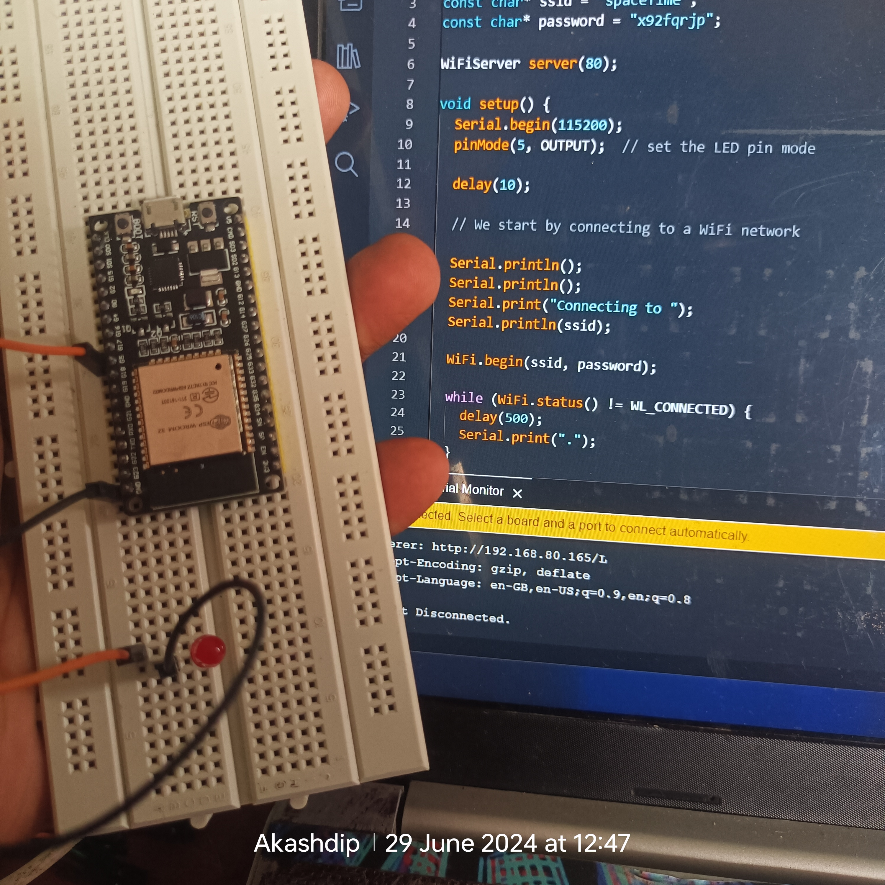
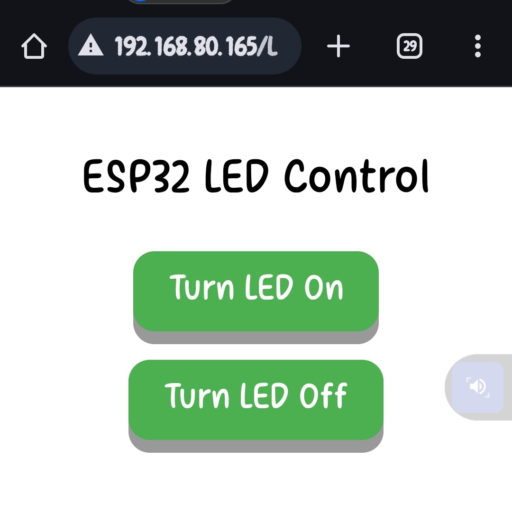

# ESP32-LED-ON-OFF-via-WIFI-BLE

# Via WIFI 

```cpp
#include <WiFi.h> 
 
const char* ssid = "spaceTime"; 
const char* password = "x92fqrjp"; 
 
WiFiServer server(80); 
 
void setup() { 
  Serial.begin(115200); 
  pinMode(5, OUTPUT);  // set the LED pin mode 
 
  delay(10); 
 
  // We start by connecting to a WiFi network 
 
  Serial.println(); 
  Serial.println(); 
  Serial.print("Connecting to "); 
  Serial.println(ssid); 
 
  WiFi.begin(ssid, password); 
 
  while (WiFi.status() != WL_CONNECTED) { 
    delay(500); 
    Serial.print("."); 
  } 
 
  Serial.println(""); 
  Serial.println("WiFi connected."); 
  Serial.println("IP address: "); 
  Serial.println(WiFi.localIP()); 
 
  server.begin(); 
} 
 
void loop() { 
  WiFiClient client = server.available();  // listen for incoming clients 
 
  if (client) {                     // if you get a client, 
    Serial.println("New Client.");  // print a message out the serial port 
    String currentLine = "";        // make a String to hold incoming data from the client 
    while (client.connected()) {    // loop while the client's connected 
      if (client.available()) {     // if there's bytes to read from the client, 
        char c = client.read();     // read a byte, then 
        Serial.write(c);            // print it out the serial monitor 
        if (c == '\n') {            // if the byte is a newline character 
 
          // if the current line is blank, you got two newline characters in a row. 
          // that's the end of the client HTTP request, so send a response: 
          if (currentLine.length() == 0) { 
            // HTTP headers always start with a response code (e.g. HTTP/1.1 200 OK) 
            // and a content-type so the client knows what's coming, then a blank line: 
            client.println("HTTP/1.1 200 OK"); 
            client.println("Content-type:text/html"); 
            client.println(); 
 
            // the content of the HTTP response follows the header: 
            client.print("<!DOCTYPE html><html>"); 
            client.print("<head><meta name=\"viewport\" content=\"width=device-width, initial-scale=1\">"); 
            client.print("<style>body { font-family: Arial, sans-serif; text-align: center; padding: 20px; }"); 
            client.print(".button { display: inline-block; padding: 15px 25px; font-size: 24px; cursor: pointer; text-align: center; text-decoration: none; outline: none; color: #fff; background-color: #4CAF50; border: none; border-radius: 15px; box-shadow: 0 9px #999; margin: 10px; }"); 
            client.print(".button:hover { background-color: #3e8e41 }"); 
            client.print(".button:active { background-color: #3e8e41; box-shadow: 0 5px #666; transform: translateY(4px); }</style></head>"); 
            client.print("<body><h1>ESP32 LED Control</h1>"); 
            client.print("<button class=\"button\" onclick=\"location.href='/H'\">Turn LED On</button>"); 
            client.print("<button class=\"button\" onclick=\"location.href='/L'\">Turn LED Off</button>"); 
            client.print("</body></html>"); 
 
            // The HTTP response ends with another blank line: 
            client.println(); 
            // break out of the while loop: 
            break; 
          } else {  // if you got a newline, then clear currentLine: 
            currentLine = ""; 
          } 
        } else if (c != '\r') {  // if you got anything else but a carriage return character, 
          currentLine += c;      // add it to the end of the currentLine 
        } 
 
        // Check to see if the client request was "GET /H" or "GET /L": 
        if (currentLine.endsWith("GET /H")) { 
          digitalWrite(5, HIGH);  // GET /H turns the LED on 
        } 
        if (currentLine.endsWith("GET /L")) { 
          digitalWrite(5, LOW);  // GET /L turns the LED off 
        } 
      } 
    } 
    // close the connection: 
    client.stop(); 
    Serial.println("Client Disconnected."); 
  } 
}
```

<p float="left">
  
  
</p>

# via BLUETOOTH 

```cpp
#include <Arduino.h> 
#include <BLEDevice.h> 
#include <BLEServer.h> 
#include <BLEUtils.h> 
#include <BLE2902.h> 
 
BLEServer *pServer; 
BLEService *pService; 
BLECharacteristic *pCharacteristic; 
 
int ledPin = 5; // GPIO 5 for LED 
 
bool ledState = false; 
 
// Define the BLECallbacks class 
class MyBLECallbacks : public BLECharacteristicCallbacks { 
    void onWrite(BLECharacteristic *pCharacteristic) { 
        String value = pCharacteristic->getValue().c_str(); // Convert to Arduino String 
         
        if (value.length() > 0) { 
            if (value == "1") { 
                digitalWrite(ledPin, HIGH); 
                ledState = true; 
            } else if (value == "0") { 
                digitalWrite(ledPin, LOW); 
                ledState = false; 
            } 
        } 
    } 
}; 
 
void setup() { 
    Serial.begin(115200); 
    pinMode(ledPin, OUTPUT); 
    digitalWrite(ledPin, LOW); 
 
    BLEDevice::init("LED Control"); // Name of your BLE device 
    pServer = BLEDevice::createServer(); 
    pService = pServer->createService(BLEUUID("4fafc201-1fb5-459e-8fcc-c5c9c331914b")); // Custom service UUID 
 
    pCharacteristic = pService->createCharacteristic( 
        BLEUUID("beb5483e-36e1-4688-b7f5-ea07361b26a8"), // Custom characteristic UUID 
        BLECharacteristic::PROPERTY_READ | BLECharacteristic::PROPERTY_WRITE 
    ); 
 
    pCharacteristic->setCallbacks(new MyBLECallbacks()); 
    pCharacteristic->addDescriptor(new BLE2902()); 
 
    pService->start(); 
 
    BLEAdvertising *pAdvertising = pServer->getAdvertising(); 
    pAdvertising->start(); 
} 
 
void loop() { 
    // Handle BLE events 
    delay(10); 
}
```
